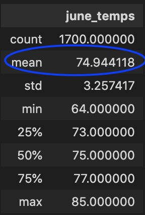
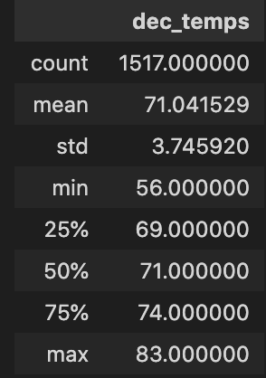

# Surfs_up Challenge Analysis

## Purpose of the Analysis
To provide the principal investor W.Avy with a weather trend comparison between the months of June and December to assist in the 
decision making for the opening of a surfshop in Oahu.

## Results
Based on the analayis I was able to determine the following :

* The average temperature on Oahu doesnt vary greatly which is ideal for the surfside business 
as indicated in the following screenshots:

* 