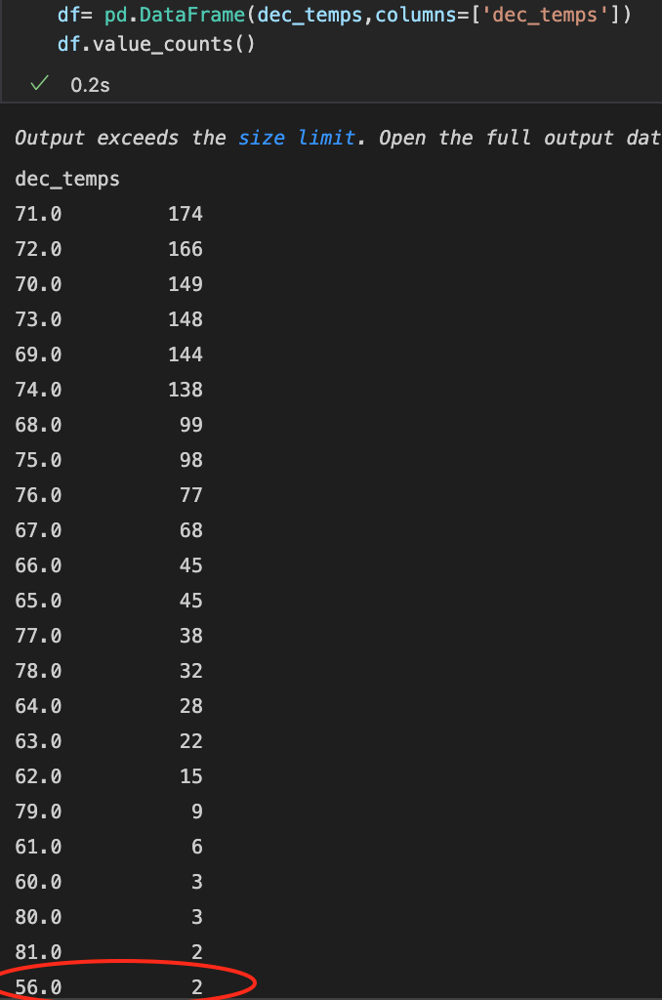

# Surfs_up Challenge Analysis

## Purpose of the Analysis
To provide the principal investor W.Avy with a weather trend comparison between the months of June and December to assist in the 
decision making for the opening of a surfshop in Oahu.

## Results
Based on the analayis I was able to determine the following :

* The average temperature on Oahu doesnt vary greatly which is ideal for the surfside business 
as indicated in the following screenshots:

* The lowest recorded temp in June was 64 degrees and only recorded once. 

* The lowest recorded temp in Dec was 56 degrees and was recorded twice . 

## Summary 
Based on the data collected I believe that the loaction chosen would be ideal to setup the intended surfside business . The weather temperatures collected suggest that the weather during the critcial summer and winter months are consistent and would provide visitors with a great overall experience . 